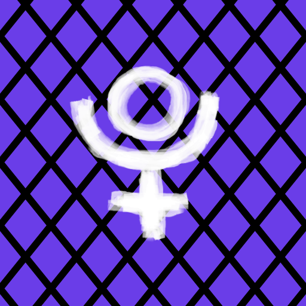

# Pluto Games README

https://pluto-games-822c0.web.app

# Install
```
git clone https://github.com/hokieknight/pluto_games.git
```
```
cd pluto_games
```
```
flutter pub get
```

**if that does not run try...**
```
flutter channel stable
```
```
flutter upgrade
```
```
flutter pub upgrade
```

# Credits
based on original game - [Secret Hitler](https://www.secrethitler.com/)
Secret Sith Images posted by Mike Inside on Board Game Geek - https://boardgamegeek.com/filepage/140680/secret-sith
(Most) Character portraits are by Marc Morera.
Tabletop Simulator templates by FragaholiC [https://steamcommunity.com/profiles/76561197968769368]
Modified with the Star Wars theme by Marlow [https://steamcommunity.com/id/darthdude]
Some assets further formatted, recoloured or created by mikeInside [https://boardgamegeek.com/user/mikeInside]

# License
Licensed under original game license -
Secret Hitler is licensed under [Creative Commons BY–NC–SA 4.0](https://creativecommons.org/licenses/by-nc-sa/4.0/). That means you have to give us credit for the original, you're not allowed to profit from it commercially in any way, and you have to license it under the exact same CC license. You also can't submit anything to an app store or anything like that.

This isn't an exhaustive list, and it's your responsibility to make sure you're not infringing on our thing.

